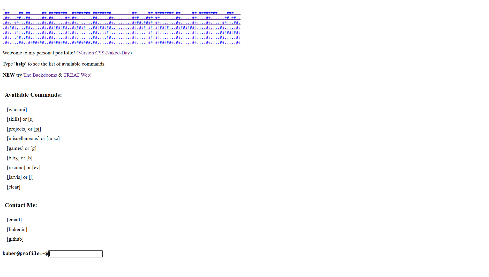

# Terminal Inspired Portfolio - CSS Naked Day Edition 🌟

---

Welcome to my terminal-style portfolio - now participating in [CSS Naked Day](https://css-naked-day.github.io/)! This is a proud celebration of web standards, semantic HTML, and accessible content. You can find my name on the [2025 participants list](https://css-naked-day.github.io/2025.html), continuing a long-standing developer tradition since 2006.

## 📂 Project Overview

This portfolio demonstrates that great functionality doesn't need fancy styling. Features include:

- **Semantic HTML Structure:** Clean, accessible markup that works perfectly without CSS
- **Terminal-Style Interface:** Command-line inspired navigation that's both functional and nostalgic
- **Responsive Design:** Works across all devices, now even more lightweight without CSS!
- **Accessibility First:** Semantic HTML ensures screen reader compatibility

## 🎮 Interactive Features

- **AI Assistant (JARVIS):** Chat with an AI assistant about my projects and skills
- **Classic Games:** 
  - Snake
  - Tetris
  - 2048
  - Flappy Bird
  - [The Backdooms](https://kuberwastaken.github.io/backdooms/)
- **Utility Tools:**
  - Calculator
  - Web search integration (Google, Wikipedia, ChatGPT, Perplexity)
  - ASCII art viewer
  - Matrix-style "Hollywood Effect"

## 🛠️ Tech Stack

- **React:** Component-based architecture
- **Semantic HTML:** Structure without styling
- **JavaScript:** Interactive features and game logic
- **Node.js:** Development environment and build tools
- **CSS:** None lol

## 🌐 Notable Features

- **Command History:** Navigate previous commands using arrow keys
- **Real-time AI Chat:** Interact with JARVIS for portfolio information
- **Multiple Search Engines:** Quick access to various search platforms
- **ASCII Art:** View terminal-style artwork
- **Game Collection:** Multiple classic games rebuilt in React
- **Responsive Commands:** Full keyboard and touch support

## 🎯 CSS Naked Day Participation

This portfolio proudly strips away all CSS styling on April 9th each year to participate in CSS Naked Day. This practice:
- Promotes web standards and semantic HTML
- Demonstrates the importance of progressive enhancement
- Shows that good design works even without styling
- Continues a beloved developer tradition since 2006

## 📱 Accessibility & Performance

Without CSS, this portfolio demonstrates:
- Lightning-fast load times
- Perfect accessibility scores
- Semantic structure
- Universal device compatibility
- Screen reader optimization
